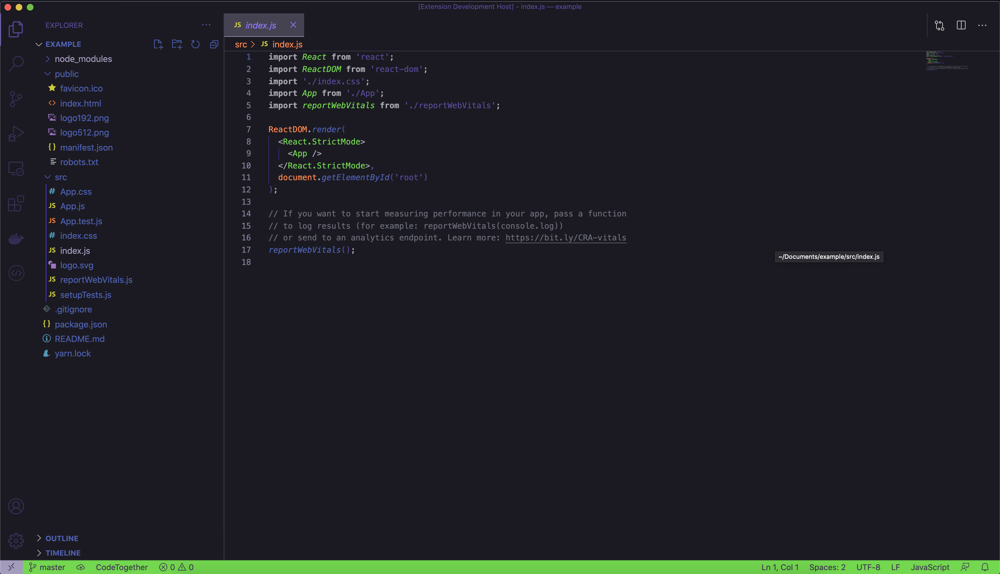
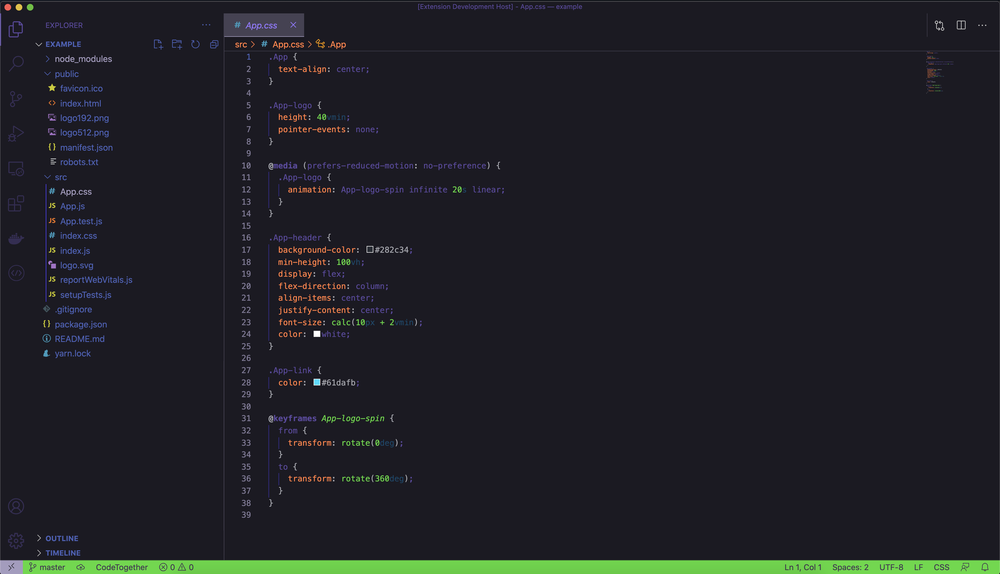

# Eva-01 theme for Visual Studio Code

An all-day theme for Visual Studio Code based on the Evangelion Unit-01 color palette.

## Screenshots

## how to install
You can find the extension on the [visual studio marketplace](https://marketplace.visualstudio.com/items?itemName=AndreaGubellini.eva-01)